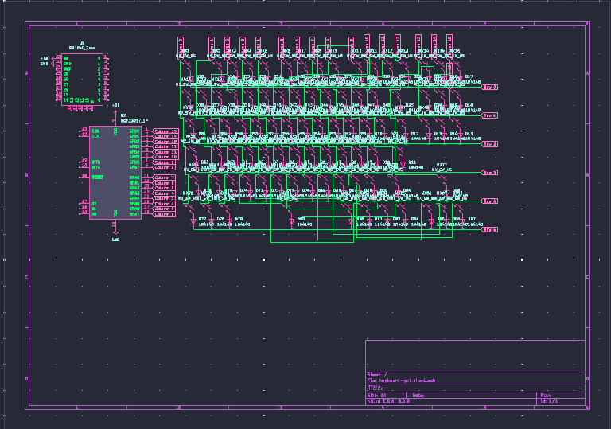
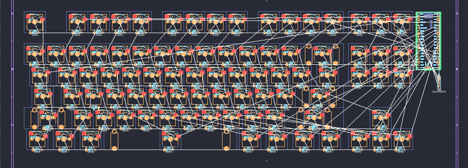
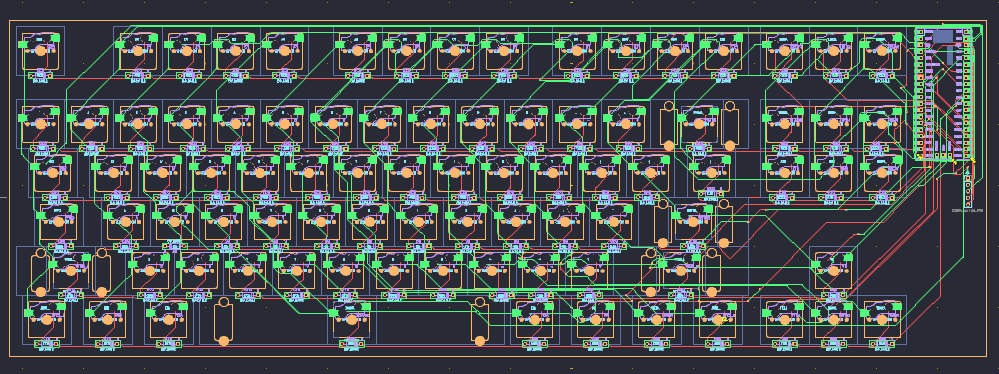
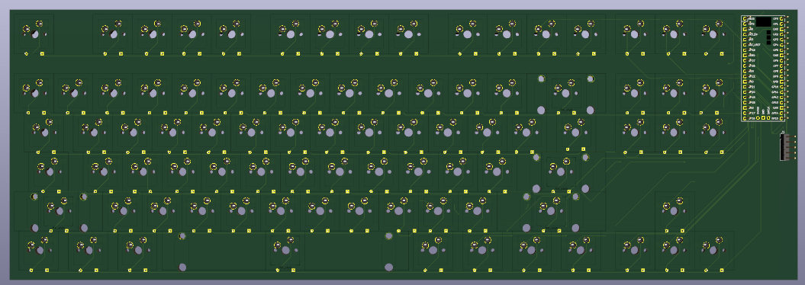
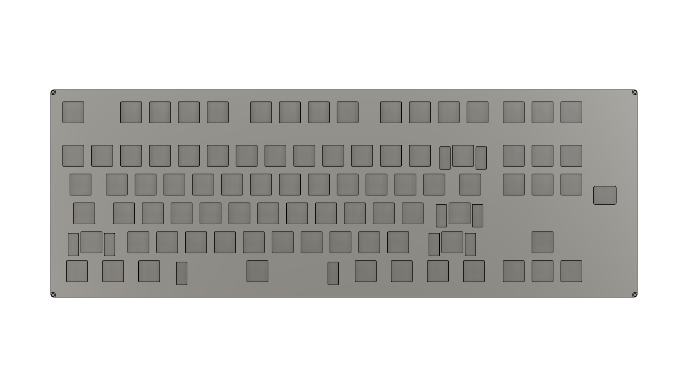
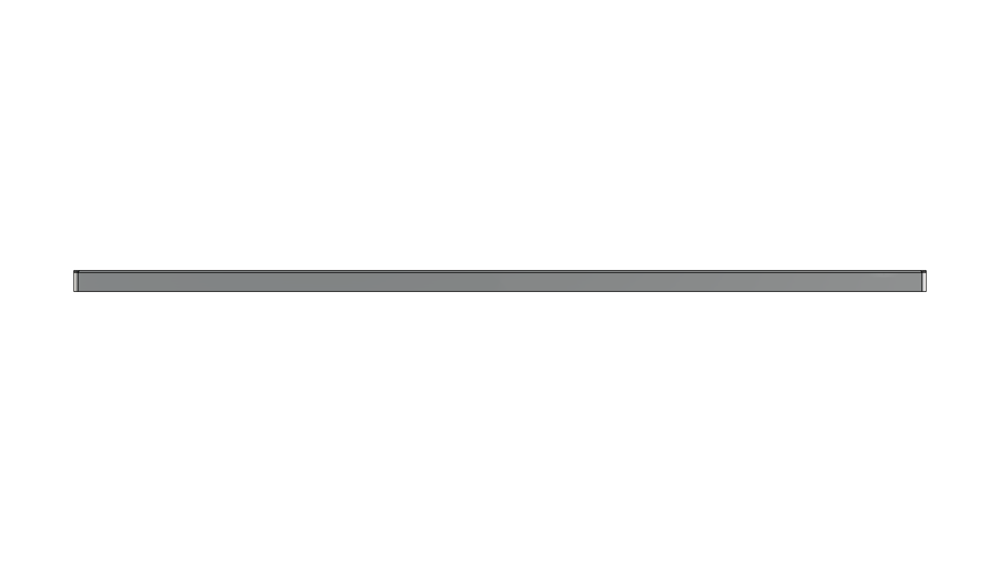
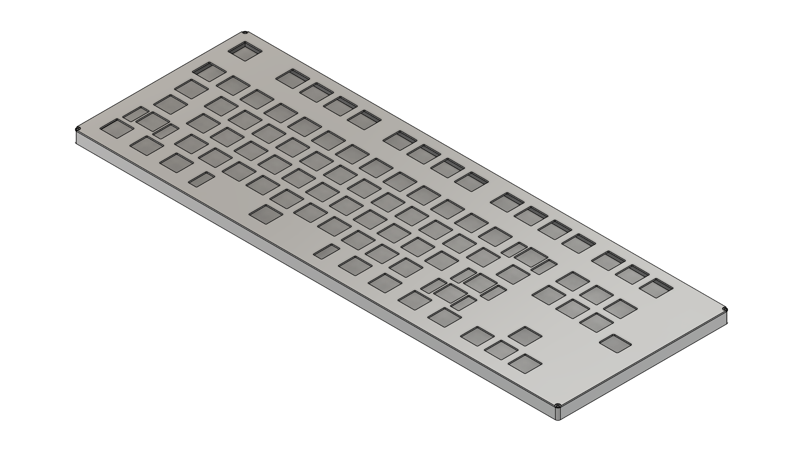

# July 17: Started the project!
3:50 PM | About 2 hours ago i started planning out the project in notepad, slept for 30 mins, woke up fresh after a nap and made first iteration product list

I searched for local sites for cheaper (and primarily faster) deliveries. Also i found that some of the items like switches, sockets and LEDs were cheaper in Poland, I would probably find them even cheaper on Aliexpress, but delivery time would be enormous.

anyways, its 4:18 PM, i am going to start making PCB

5:58 PM ended designing for today

# July 18: Journal, PCB and possibly a case!
7:05 PM, made hackatime account and connected it to VSC few seconds ago! Right now i am going to add images for what i had done yesterday as i forgot to do that then. After that i will continue making PCB!

On the right you can see keyboard switch sockets, it is wired like mess cause i wanted to make it in the size and shape of actual keyboard for reference! Although i know i will need to make it again later in pcb editor :<

Decided to change rp2040-zero for rpi pico as it has more ports, for the few missing needed ports i will use Waveshare 3708 PCF8574 expander module as it costs only 2 PLN (less than half a dollar!) more, i dont need to use pull-up resistors etc which will simplify pcb and will be also cheaper in the long term probably. And it gives me more than enough ports!

Resigned from screen and expander whatsoever, after a bit of thinking i came to conclusion that i dont need it, i wouldn't see the screen anyway *(i was stuck at writing this word for a minute cause i forgot that it is anyway not anywhere and was sensing i wrote it wrong lol)* and it is only complicating the PCB and making whole thing bigger

I also resigned from LED backlighting, i figured it is too much work for me as it is my second hardware project ever, and first keyboard (excluding hackpad), especially since it has hot-swap.

10:41 PM ended designing for today, almost 4h straight, at the end: i resigned from screen, expander and backlighting. Connected everything in schematic. Laid out everything on PCB. Left for me for making phisical part of the project is wire everything together using paths and design 3d case for it. And of course connect it all when it arrives.

# July 19: The day of making traces
7:06 PM starting working on PCB, need to make traces for everything, but first i will label each key socket for convienency

8:15 PM finished routing traces! This is how it looks now:

And this is how it looks in KiCad 3D model viewer:

8:36 PM - 9:41 PM took a break for food, right now i need to make case

10:12 PM ending designing for today, hoping tommorow will be last day of designing! Make body of the case (well, kinda), tommorow need to make plate etc

# July 20: The birth of the case
3:53 PM i am starting 3d modeling for today, hoping it wouldn't be as big of a chore as i suppose

5:24 PM ended designing 3d case! It wasnt as frustrating as i thought.

5:53 PM made screw holes i forgot to add! i am gonna add images to the journal of project rn!

right now i am adding all the files to the repo and making the ones that i didnt do before! also i slightly changed journal cause it was a mess to view in gallery, i will make it more preety at the end! if you want to see earlier versions of it you can see it in github repo change history!