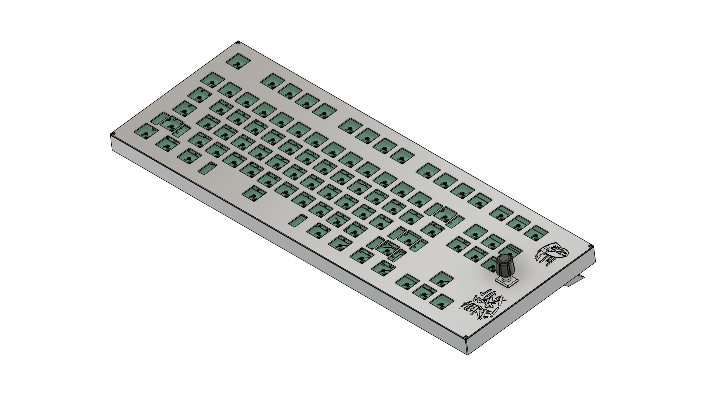
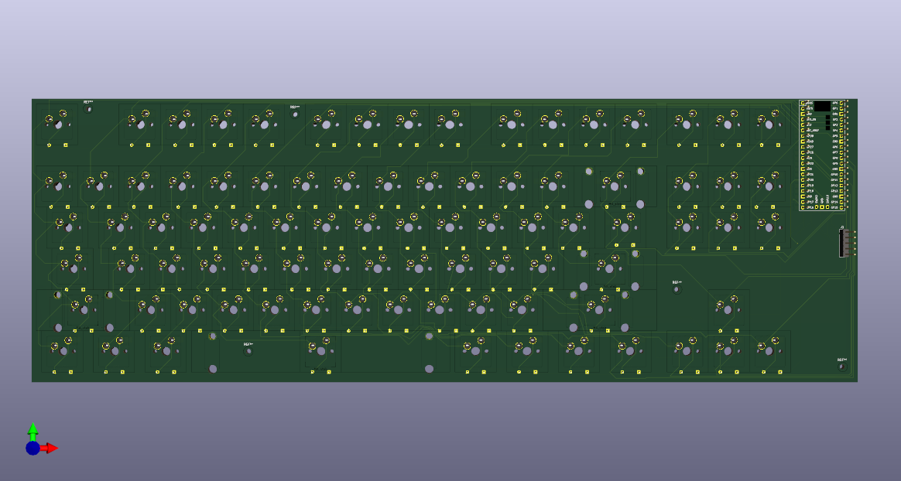

# hackclub-keyboard
Keyboard with hot-swap and rotational knob made alongside grant program from hackclub.com

# Reasons why i made this project

I made this keyboard for few reasons:
1. I wanted to make something more complicated than hackpad
2. I like doing things
3. I need new keyboard badly as mine is randomly doubling characters or holding them down or not registering space
4. I wanted something that i made not that i bought from random seller

# CAD Pictures:
Picture of the full model:

# PCB Pictures:
Schematics:

PCB:

PCB 3D Viewer KiCad:

# BOM:

| Item | Price PLN | Price USD | Link |
| --- | --- | --- | --- |
| Keycaps | 63.19 | 17.3 | https://www.aliexpress.com/item/1005008465121722.html |
| Stabilizers | 35.89 | 9.83 | https://www.aliexpress.com/item/4001143514438.html |
| M2x4mm screws | 4.39 | 1.20 | https://www.aliexpress.com/item/1005008799074471.html |
| DFRobot EC11 Encoder | 13.90 + 4.99 shipping | 3.81 + 1.37 shipping | https://botland.com.pl/enkodery/9533-czujnik-obrotu-impulsator-enkoder-obrotowy-dfrobot-ec11-6959420912414.html |
| JLCPCB PCB | 136.81 | 37.46 | https://www.jlcpcb.com |
| IN4148W T4 Diodes | 7.99 | 2.19 | https://www.aliexpress.com/item/1005009063199018.html |
| Gateron Hot-Swap Sockets (90pcs) | 25.76 | 7.05 | https://www.aliexpress.com/item/1005002637150446.html |
| Gateron Switches (90pcs) | 80.39 | 22.01 | https://www.aliexpress.com/item/1005006376024657.html |
| Raspberry Pi Pico | 13.31 | 3.64 | https://www.aliexpress.com/item/1005006087823796.html |
| Total | PLN | USD | - |
| - | 386.62 | 105.86 | - |
